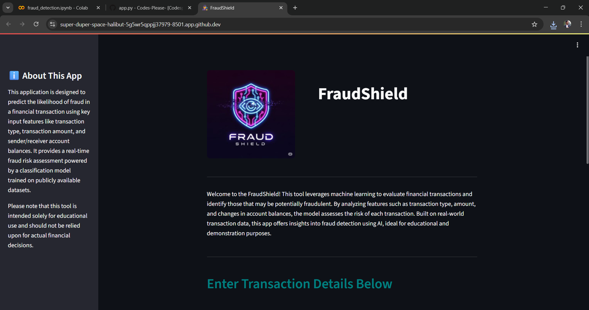
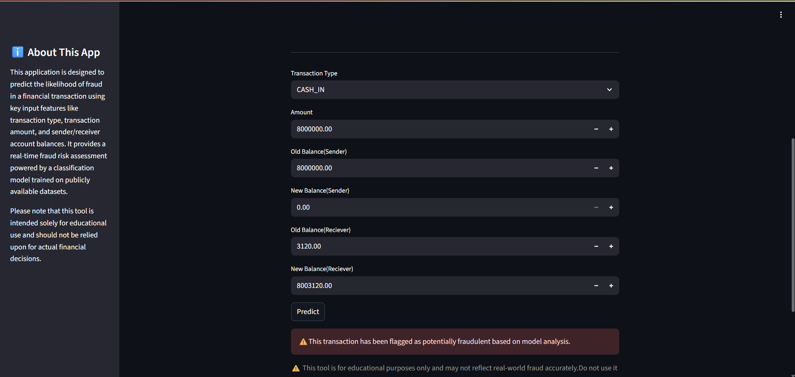

# 🕵️‍♂️ Fraud Detection Predictor

**Fraud Detection Predictor** is a machine learning-based web app that predicts whether a financial transaction is potentially fraudulent. It uses a trained `RandomForestClassifier` on a real-world dataset of over 1.2 million transactions and is built using Python and Streamlit.

---

## 📁 Project Structure

```
Fraud_Detection/
├── app.py                       
├── README.md                    
├── requirements.txt             
├── dataset/                     
├── Images/                      
├── model/
│   └── fraud_detection.pkl      
└── notebook/
    └── fraud_detection.ipynb    
```

---

## 📊 Dataset
# 📁 Dataset Not Included

This folder is intentionally left empty.

The dataset is too large to upload to GitHub.  

- **Source**: [Kaggle - Fraud Detection Dataset](https://www.kaggle.com/datasets/amanalisiddiqui/fraud-detection-dataset?resource=download)
- Contains various types of transactions and account balance information.

---

## 🧠 Model Information

- **Model Used**: `RandomForestClassifier`
- **Task**: Binary classification – predict whether a transaction is fraudulent (1) or legitimate (0)

### 📈 Classification Report

| Class | Precision | Recall | F1-score | Support |
|-------|-----------|--------|----------|---------|
| Legit (0) | 1.00 | 1.00 | 1.00 | 1,270,904 |
| Fraud (1) | 0.96 | 0.80 | 0.87 | 1,620 |
| **Accuracy** |  |  | **1.00** | 1,272,524 |
| **Macro Avg** | 0.98 | 0.90 | 0.94 |  |
| **Weighted Avg** | 1.00 | 1.00 | 1.00 |  |

---


## 🔍 App Features

- Input fields for:
  - Transaction type
  - Amount
  - Old and new balances (sender & receiver)
- Returns a prediction:
  - ✅ "This transaction appears to be legitimate."
  - ⚠️ "This transaction may be potentially fraudulent."

---

### 📸 Screenshots

#### 🏠 Home Page
Displays the application's main interface with input form and introductory content.



---

#### 🔍 Fraud Prediction Result
Shows an example prediction output highlighting whether the transaction is flagged as fraudulent.



---


## ⚠️ Disclaimer

This application is intended for **educational and demonstration purposes only**.  
While the model shows high performance, **there is still room for improvement**, particularly in minimizing false negatives.  
It is **not recommended for real-world financial use** without further validation.

---


## 🙋‍♂️ Author

Created by **Subhankit Bandyopadhyay**  
Feel free to fork, share, and contribute!